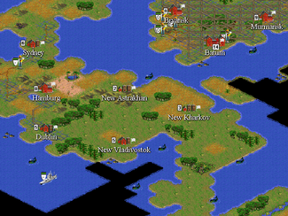
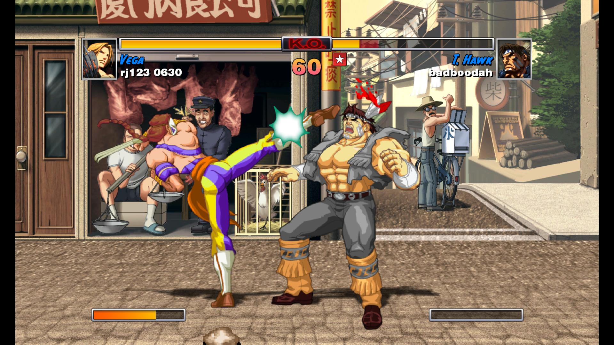
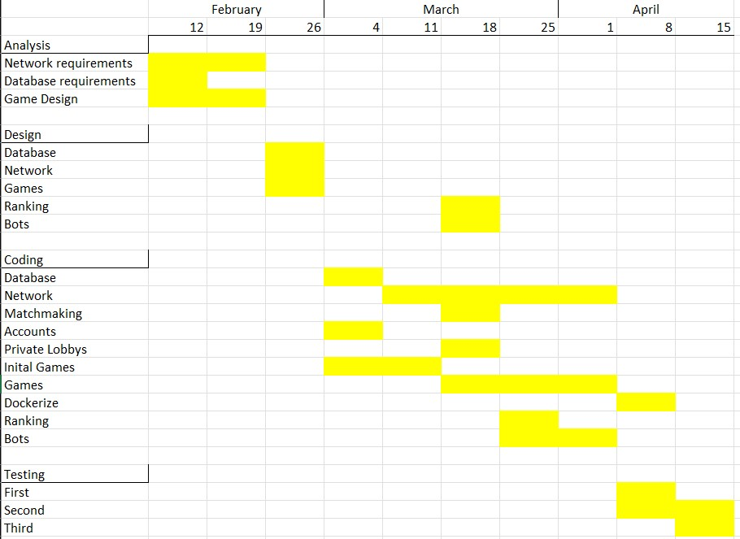

# Project Definition Document

## Cover Sheet

- PaperClip: A backend networking and account management solution for game servers.
- Author: Harry Whitehorn - <harry.whitehorn@city.ac.uk>
- Course: BSc Computer Science
- Consultant: Stephanie Wilson - <s.m.wilson@city.ac.uk>
- Proposed by: Harry Whitehorn
- Proprietary Interests: N/A
- Word Count: 697

## Proposal

### Problem to be solved

Networking and user interaction is a basic requirement for many online video games. This can require a large amount of time and cost from developers. This project will aim to provide a lightweight solution to both of these elements that can then be easily applied to a game-sever.

There are a variety of different methods for handling game-time networking such as delay-based and rollback. The former is more suited to slow or turn based games due to the nature of an implicit delay as users synchronize. Fast-paced games such as shooters or fighting games rely on quick interactions meaning that delay-based networking is not suitable. Rollback works by predicting and then updating the inputs of non-local players.

>MicroProse (1996) *Civ II (1996)* is a turn based game suitable for delay-based.  

>Backbone Entertainment (2008) *Super Street Fighter II Turbo HD Remix* was one of the first games released with rollback.  

### Project objectives

The primary objective of this project is to create a lightweight networking and user account solution. This can better be described with two main goals:

1. This project shall manage connections between a game-sever and game-client. This will include handling both matchmaking and in-play communications.

2. This project shall manage storing and retrieving non-volatile information from a database sever. This will include user information and, therefore, handling account validation as well as leaderboards.

3. Create a variety of small and simple games to implement the networking and account features.

Further objectives include:

- A ELO/rank based system for matching players of a equal skill level.
- Account interaction such as friends and private lobbies.
- Customable bot accounts for relevant use in multiplayer environments.
- Ensuring that the solution is lightweight, reliable and platform-agnostic.
- Dockerize.

### Beneficiaries

The primary beneficiaries include:

- Me, due to learning network intricacies.

- Independent or small game development teams, who might lack either the time or resources to develop custom handling for multiplayer.

### Work Plan

The project will be created primarily to work with the godot game engine. Additional game engine support will be implemented and testing if there is ample time but this is not expected. The best language to use will be part of the initial research, but python is a likely candidate. Additionally, the database management system best suited will be part of the research but some potential candidates include SQLite and MariaDB.

### Risks

|     Objective       |     Risk    |     Severity    |     Score    |     Risks                                                                    |     Actions                                                                                                                              |
|---------------------|-------------|-----------------|--------------|------------------------------------------------------------------------------|------------------------------------------------------------------------------------------------------------------------------------------|
|     Network         |     2       |     5           |     10       |     Vulnerabilities                                                          |     Ensure that the   system is not vulnerable to any malicious interaction. Including 'cheating'.                                                        |
|     Accounts        |     1       |     4           |     4        |     GDPR                                                                     |     Limit type of   stored data and where data is relevant unsure stored in accordance to GDPR.                                          |
|     Safeguarding    |     2       |     4           |     8        |     User safety                                                              |     Limit   interactions between user accounts.                                                                                          |
|     Development     |     5       |     5           |     25       |     Time                                                                     |     Ensure that progress   is made in accordance with work plan and actively update when system requirements   change.                   |
|     Testing         |     3       |     4           |     12       |     Engagement                                                               |     Ensure in advance   that participants are willing and have the appropriate time and resources to   complete required testing.        |
|                     |     4       |     4           |     16       |     Time                                                                     |     Ensure that   time is left to testing can be completed. (See development actions.)                                                   |
|     Matchmaking     |     3       |     1           |     3        |     Developing appropriate   ELO/rank system may prove to be too complex.    |     ELO/rank   system can be dropped in favour of random matchmaking if the former cannot be   developed within the time constraints.    |
|     Bots            |     4       |     2           |     8        |     Developing appropriate   bot system may prove to be too complex.         |     Bot system   can be dropped if it cannot be finished in time.                                                                        |                                                                   |

#### Research Ethics Checklist

See `Ethics_Review_Form.doc`

### References

1. MicroProse, 1996, *Civilization II*, MicroProse

2. DASHBot, (2010). *CivII 01.png*. [image online] Wikipedia. Available at: <https://en.wikipedia.org/wiki/File:CivII_01.png> [Accessed 10 Feb. 2024].

3. Backbone Entertainment, 2008, *Super Street Fighter II Turbo HD Remix*, Capcom

4. Gamescore Blog, (2008). *Super Street Fighter II Turbo HD Remix 12*. [image online] Available at: <https://www.flickr.com/photos/gamerscore/3058520175> [Accessed 10 Feb. 2024].
