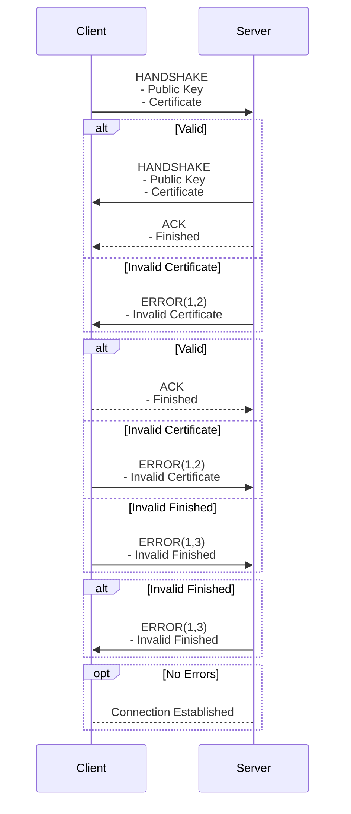

# 9.4 Packet Specification

## Packets

### DEFAULT

DEFAULT Packet Specification:

```{.include}
default.tex
```

#### Version

Including a packet version will allow for future changes in specification which out breaking older systems. A recipient must reject a packet if the version does not match the internal version.

#### Type

The next header is the packet type. This will instruct the recipient on how to unpack the packet. The types are defined as follows:

```{.include}
packet_types.tex
```

For the DEFAULT packet, the packet type is 0 (padded to 4 bits).

#### Flags

The packet flags are a bit field of the different available flags. Each flag can be toggled independently with some implying the presents of certain headers. The flags are as follows:

```{.include}
flags.tex
```

#### Sequence ID

The 16-bit sequence ID proved an *unique* identifier for each packet. The Sequence ID is set according to the senders internal value and incremented after each assignment. This allows for the recipient to determine an order to the packets received. The sequence ID must wrap around at $2^{16}$ back to $0$.

#### Fragment ID

The fragment ID is the position of the fragment in the total packet. This tells the recipient the how to reorder the data of the fragments packets into the final packet. For this header to be present FRAG must be set in the packet's flags.

#### Fragment Number

The fragment number is the total number of fragments making up the final packet. The recipient will keep collecting fragments until the number of received fragments is equal to the number stated in each fragments fragment number. At this point the final packet can be compiled yielding the full data. For this header to be present FRAG must be set in the packet's flags.

#### Init Vector

The init vector is 16 bit integer to be used by the recipient when decrypting the packet data. For this header to be present, the ENCRYPTED flag must be set.

#### Checksum Hash

The checksum is a hash off the packet's data to be checked upon receival. If the checksum check fails, the recipient should reject the packet. For this header to be present the CHECKSUM flag must be set.

#### Data

This is the data field of the packet. Upon a valid receival of a packet, the data is returned to the application layer.

---

### ACK

The ACK packet is sent as a reply to any received packets where the RELIABLE flag is set.

ACK packet specification:

```{.include}
ack.tex
```

#### ACK Default Packet Headers

The packet type must be 1 (padded to 4 bits).

#### ACK ID

The ACK ID is the sequence ID of the packet that the ACK is in acknowledgment of.

#### ACK Bits

The ACK Bits is a bit field representing the status of the last 16 previous ACKs such that $[ID_{-1}, ID_{-2}, ID_{-3}, ... , ID_{-17}]$ where *$ID$ is equal to the ACK ID of the ACK packet*. This help to mitigate against packet loss as each ACK packet also includes an acknowledgment of the last 16 packets (if received).

#### ACK Data

This is the data field of the packet. This is used during the handshake to send the finished data.

---

### AUTH

The AUTH packet is sent during the handshake between a client and server.

AUTH packet specification:

```{.include}
auth.tex
```

#### AUTH Default Packet Headers

The packet type must be 2 (padded to 4 bits).

#### Public Key Size

This is the size *in bytes* of the public key also included in the packet. As different key systems may yield different size keys this tells the recipient where the public key ends when unpacking the packet.

#### Public Key

This is the public key of the sender which is used in generating the session key.

#### Certificate Size

This is the size *in bytes* of the certificate also include in the packet. As different certificate systems / encodings may yield different sized certificated this, in conjunction with the public key size, tell the recipient where the certificate ends when unpacking the packet.

#### Certificate

This is the certificate of the sender. This allows for the recipient to validate the identity of the sender.

---

### HEARTBEAT

The HEARTBEAT packet is sent by the server at fixed intervals to check that a client is alive and responding as normal.

HEARTBEAT packet specification:

```{.include}
heartbeat.tex
```

#### HEARTBEAT Default Packet Headers

The packet type must be set to 2 (padded to 4 bits).

#### Heartbeat

This is a boolean value (padded to 8 bits) dictating the nature of the packet with False and True dictating PING and PONG respectively. If a client receives a PING it must reply with a PONG. A server will expect to get a PONG value back and, after enough failures to reply, will mark a client connection for termination.

#### HEARTBEAT Data

Unused field.

---

### ERROR

The ERROR packet allows for connection members to declare if an error has occurred.

ERROR packet specification:

```{.include}
error.tex
```

#### Error Major

This is the Major component of the error being declared.

#### Error Minor

This is the Minor component of the error being declared. It must be present but can be set to 0 (padded to 4 bits).

#### ERROR Data

This field allows for additional information about the error to be shared. This used for logging purposes but can also be used for displaying *user-friendly* error messages to a client.

### Error Codes

The error codes are defined as follows:

```{.include}
error_codes.tex
```

---

## Behavior

### Handshake

The handshake is always initiated by the client with the client sending an AUTH packet to the server. The server checks the certificate (if present) and either responds with its own AUTH packet or an ERROR packet. The server also sends an ACK packet containing the handshake finished. The client, upon receiving the server's AUTH packet performs the same checks and yields an ERROR packet on a failure. Otherwise, the client also calculates the finished and checks it against the server's version. If it's valid it replies with its own finished ACK otherwise sending an ERROR. The server also checks the client's value for finished and sends an error on failure. If no ERRORs were yielded the parties are considered connected and can begin communication otherwise the connection must be aborted by both parties.



#### Session Key

Each party generated a session key using their own private key and the other parties public key in a key exchange. This session key is then used in conjunction with the init vector when encrypting and decrypting packet data.

#### Finished

The finished ACK packet contains a hash generated from the session key. This allows both parties to validate that the other party has the private key for their respective public key as well as acting as a pseudo-checksum to verify the handshake.

#### Certificate Validation

Certificate validation requires sending a TCP request to the TCP server with the certificate. The TCP server is then able to validate the certificate and yield its success or failure.

---

### Flags Behaviour

#### Reliable

If a packet is sent with the reliable flag, the sender should expect a ACK packet with the relevant ACK ID and should resend the packet until an ACK is received.

When a packet with the reliable flag set is received the recipient should first set its local record of ACKed packet's accordingly and then reply with an ACK packet. If the packet has already been ACKed the data should not be yielded to the application layer.

#### Checksum

If a packet is sent with the checksum flag set, the sender must calculate a CRC-32 hash with the packet's data and append it to the relevant header.

When a packet with the checksum flag set is received the recipient must recalculate a CRC-32 hash on the packet's data and check that it matches the packets checksum header. On a failure, the recipient must respond with a CHECKSUM ERROR (3.9) and discard the packet.

#### Compressed

If a packet is sent with the compressed flag set, the sender must perform a compression on the packet's data.

When a packet with the compressed flag set is received the recipient must decompress the packet's data before yielding to the application layer. If the decompression fails, the recipient must respond with a COMPRESSION ERROR (3.8) and discard the packet.

#### Encrypted

If a packet is sent with the encrypted flag set, the sender must perform an encryption on the packet's data using the session key and a randomly generated init vector. The init vector must then be appended to the relevant packet header.

When a packet with the encrypted flag set is received, the recipient must preform decrypt the packet's data using the session key and the init vector from the packet's headers before yielding the packet's data to the application layer. If the decryption fails, the recipient must respond with a INIT VECTOR ERROR (3.7) and discard the packet.

#### Frag

If a packet is sent with the frag flag set, the sender must split the data into sub-packets, each with the appropriate fragment id and fragment number.

When a packet with the frag flag set is received, the recipient must buffer the packet. It can then check to see if all other frag packets with the same sequence id have been already buffered by checking the fragment number. If so, the frag packets can be compiled into one packet, using each sub-packet's fragment id and the data can be yielded.

---

### Disconnection

#### Client Disconnect

When a client goes to terminate it must first send a CLIENT DISCONNECT ERROR (2.2) packet. It should then wait for acknowledgement before terminating gracefully. It may terminate after some timeout value if it fails to receive a response.

When a server receives a client disconnect is must acknowledge this before removing the client.

#### Server Disconnect

When a server goes to terminate it must first send a SERVER DISCONNECT ERROR (2.1) packet. It should then wait for acknowledgement from each client before terminating gracefully. It  may terminate after some timeout value if it fails to receive a response from a client.

When a client receives a server disconnect it must acknowledge this before terminating itself (without sending a client disconnect).
